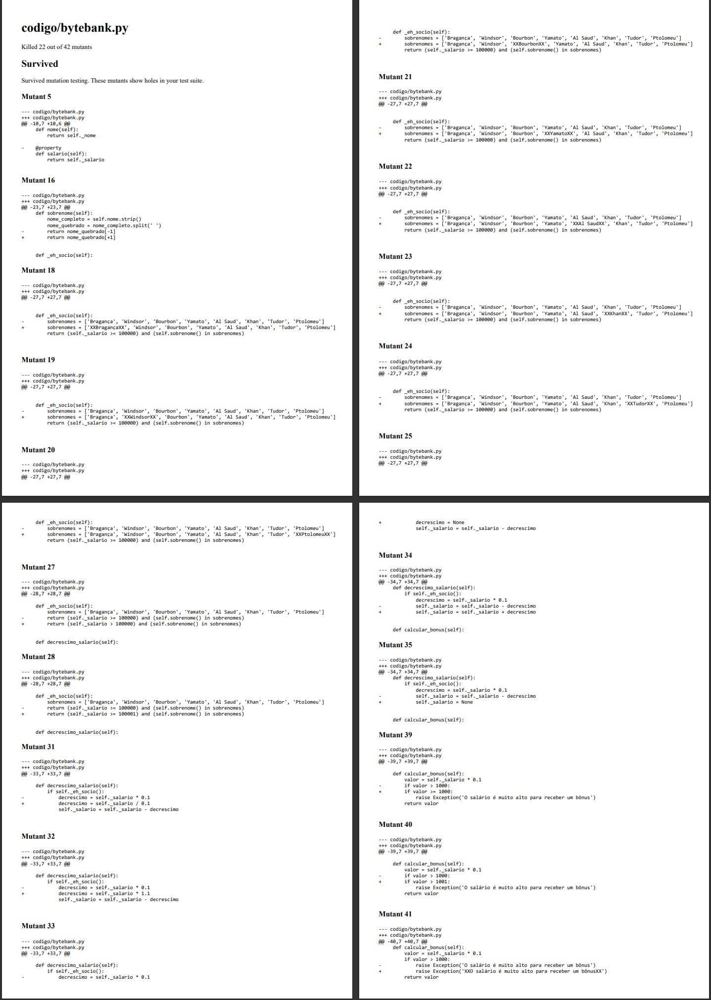
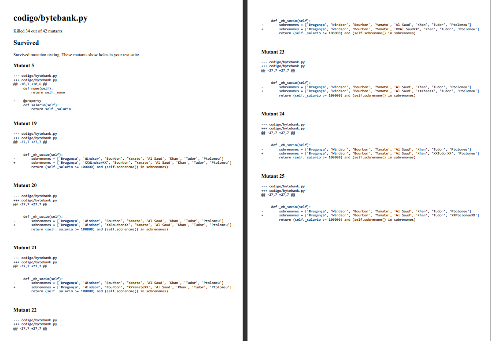

# ATIVIDADE 2 - Aplicação de Testes de Mutação em Python

## Etapa 1: Acessando o Repositório
- Acesse o repositório do exemplo disponível no GitHub. (https://github.com/alura-cursos/2622-python-tdd)
- **Clone o repositório**:
  - https://github.com/alura-cursos/2622-python-tdd.git


## Etapa 2: Preparando o Ambiente de Desenvolvimento
- Descompacte o conteúdo do repositório em uma pasta local.
- Abra o editor de código de sua preferência. No vídeo, é utilizado o **Visual Studio Code** (VS Code).
  - **Nota**: Para utilizar o VS Code com Python, algumas extensões específicas devem estar instaladas.


## Etapa 3: Configuração do Ambiente Virtual
- Instale o **Python 3.7** (ou superior) e o **virtualenv**.
- Crie um ambiente virtual para isolar as bibliotecas necessárias.
  - Comando para criar o ambiente virtual: 
    ```bash
    python3 -m venv venv
    ```
  - Ative o ambiente virtual:
    ```bash
    source venv/bin/activate  # Linux/Mac
    venv\Scripts\activate  # Windows
    ```

## Etapa 4: Instalando as Dependências
- Instale as bibliotecas necessárias listadas no arquivo `requirements.txt`:
  ```bash
  pip install -r requirements.txt
  ```
- As principais bibliotecas são:
  - **pytest**: Framework para testes.
  - **pytest-cov**: Plugin do pytest para medir a cobertura de código.
  - **mutmut**: Ferramenta para aplicar teste de mutação.

## Etapa 5: Executando Testes e Medindo Cobertura
- Execute os casos de teste utilizando o pytest:
  ```bash
  pytest -vv [caminho_para_o_arquivo]
  ```
- Verifique a cobertura de código:
  ```bash
  pytest -vv [caminho_para_o_arquivo] --cov=cal
  ```
- Gere um relatório HTML de cobertura:
  ```bash
  pytest -vv [caminho_para_o_arquivo] --cov=cal --cov-report=html
  ```

## Etapa 6: Classe Funcionário
O código define uma classe `Funcionario` que representa um funcionário com alguns atributos e métodos para manipular e acessar suas informações. 

## Atributos
- `nome`: Nome do funcionário.
- `data_nascimento`: Data de nascimento do funcionário no formato 'DD/MM/AAAA'.
- `salario`: Salário do funcionário.

## Métodos
- **`idade`**: Calcula a idade do funcionário com base no ano de nascimento.
- **`sobrenome`**: Retorna o sobrenome do funcionário, assumindo que é a última palavra no nome completo.
- **`_eh_socio`**: Método privado que verifica se o funcionário é considerado um "sócio" com base no salário e sobrenome.
- **`decrescimo_salario`**: Aplica um desconto de 10% no salário se o funcionário for um "sócio".
- **`calcular_bonus`**: Calcula um bônus de 10% sobre o salário. Se o valor do bônus for maior que 1000, lança uma exceção.

## Etapa 7: Resumo do Código de Testes

O código fornece uma série de testes unitários para a classe `Funcionario`, utilizando o framework de testes `pytest`. Os testes verificam o comportamento dos métodos da classe `Funcionario` em diferentes cenários.

#### 1. Teste de Idade
- **Descrição**: Verifica se o método `idade` retorna o valor correto para uma data de nascimento específica.
- **Entrada**: `'13/03/2000'`
- **Esperado**: 24 (nota: o valor original no código é 22, indicando um erro)
- **Verificação**: Compara o resultado da idade com o valor esperado.

#### 2. Teste de Sobrenome
- **Descrição**: Verifica se o método `sobrenome` retorna o sobrenome correto a partir de um nome completo.
- **Entrada**: `' Lucas Carvalho '`
- **Esperado**: `'Carvalho'`
- **Verificação**: Compara o sobrenome obtido com o valor esperado.

#### 3. Teste de Desconto no Salário
- **Descrição**: Verifica se o método `decrescimo_salario` aplica corretamente um desconto no salário se o funcionário for um "sócio".
- **Entrada**: Salário de `100000` e nome `'Paulo Bragança'`
- **Esperado**: `90000`
- **Verificação**: Compara o salário após o desconto com o valor esperado.

#### 4. Teste de Cálculo de Bônus
- **Descrição**: Verifica se o método `calcular_bonus` calcula corretamente o bônus para um salário dentro do limite.
- **Entrada**: Salário de `1000`
- **Esperado**: `100`
- **Verificação**: Compara o bônus calculado com o valor esperado.

#### 5. Teste de Exceção no Cálculo de Bônus
- **Descrição**: Verifica se o método `calcular_bonus` lança uma exceção quando o salário é muito alto.
- **Entrada**: Salário de `100000000`
- **Esperado**: Lançar uma exceção
- **Verificação**: Certifica-se de que uma exceção é lançada.

## Etapa 8: Executando o Teste de Mutação
- Utilize o **Mutmut** para aplicar o teste de mutação e verificar a robustez dos casos de teste:
  ```bash
  mutmut run --paths-to-mutate [caminho_para_o_arquivo]
  ```
- O Mutmut criará várias versões mutantes do código original e executará os testes contra essas versões.

## Etapa 9: Analisando os Resultados do Teste de Mutação
- Ao final da execução, o Mutmut fornecerá um resumo dos mutantes que foram "mortos" e aqueles que sobreviveram.
- Utilize comandos do Mutmut para obter mais detalhes sobre os mutantes que sobreviveram:
  ```bash
  mutmut results
  ```
- **Dica**: Utilize para gerar um arquivo html contendo todos os mutantes sobreviventes. Dessa forma, é possível analisá-los de forma mais detalhada.
  ```bash
  mutmut html
  ```

## Resultados
- Foram adicionados alguns testes no conjunto de testes já existentes, aumentando a detecção dos mutantes de 22 para 34.
- #### Conclusão
  - Com a utlização do mutmut repetidamente é possível reduzir drasticamente a quantidade de vulnerabilidade nos testes envolvidos no problema em questão.

- Mutações com o código original

- Mutações com testes adicionados

---
